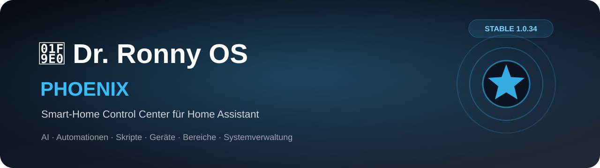

<div align="center">



# 🧠 Dr. Ronny OS Phoenix

**Dein Smart-Home Control Center für Home Assistant.**  
Mehr Übersicht. Weniger Klicks. Alles an einem Ort.

[](./phoenix/config.yaml)
[](https://www.home-assistant.io/)
[](./phoenix/config.yaml)

### 🚀 Jetzt Phoenix installieren

[](https://my.home-assistant.io/redirect/supervisor_addon_repository/?repository_url=https%3A%2F%2Fgithub.com%2FFairestDoc2%2Fdr-ronny-os-apps)

[📥 Installationsanleitung](#-installation-in-3-schritten) · [✨ Funktionen](#-was-steckt-in-phoenix) · [⚙️ Voraussetzungen](#%EF%B8%8F-voraussetzungen)

</div>

---

## 🔥 Dein Home Assistant. Dein Control Center.

Je mehr Geräte, Entitäten, Bereiche, Automationen und Skripte zu Home Assistant hinzukommen, desto aufwendiger kann die Verwaltung werden. **Phoenix bringt diese Aufgaben in einer modernen, zentralen Oberfläche zusammen.**

| 🏠 Übersicht & Organisation | ⚡ Automationen & Skripte | 🧠 Intelligente Unterstützung |
| :--- | :--- | :--- |
| Bereiche, Geräte, Entitäten und Labels übersichtlich verwalten. | Automationen und Skripte zentral finden, bearbeiten und ausführen. | Ronny AI unterstützt bei Analysen und sinnvollen Zuordnungen. |

### ✨ Was steckt in Phoenix?

- 🧠 **Ronny AI:** Unterstützung für Geräteanalysen und Bereichsvorschläge.
- 🏠 **Bereiche & Labels:** Bereiche erstellen, umbenennen, organisieren und Zuordnungen verwalten.
- 📱 **Geräte & Entitäten:** Überblick über Geräte, Entitäten und ihre Bereiche.
- ⚡ **Automationen:** Automationen zentral verwalten und relevante Abläufe bearbeiten.
- 📜 **Skripte:** Skripte finden, ausführen und verwalten, inklusive komfortabler Auswahlfunktionen.
- 💾 **Sicherungen & System:** Zentrale Funktionen für Home-Assistant-Verwaltung und Sicherungen.
- 🎨 **Phoenix-Oberfläche:** Eigenes Dark-Design, einheitliche Bedienelemente und responsive Darstellung für Desktop, Tablet und Smartphone.
- 🌍 **Mehrsprachig:** Oberfläche in mehreren Sprachen.

> **Für wen?** Für Home-Assistant-Nutzer, die mehr Kontrolle und Übersicht wünschen – vom wachsenden Smart Home bis zu umfangreichen Installationen.

---

## 📥 Installation in 3 Schritten

**Phoenix wird als Home-Assistant-Add-on installiert.** Du musst keinen ZIP-Download manuell entpacken.

### 1. Repository hinzufügen

**Einfachster Weg:** Klicke auf den Button. Home Assistant öffnet den Dialog zum Hinzufügen des Repositories.

[](https://my.home-assistant.io/redirect/supervisor_addon_repository/?repository_url=https%3A%2F%2Fgithub.com%2FFairestDoc2%2Fdr-ronny-os-apps)

**Alternativ manuell:** Öffne **Home Assistant → Einstellungen → Add-ons → Add-on Store → ⋮ → Repositories** und füge diese URL hinzu:

```text
https://github.com/FairestDoc2/dr-ronny-os-apps
```

### 2. Add-on installieren

Öffne im Add-on Store **🧠 Dr. Ronny OS Phoenix**, klicke auf **Installieren** und warte, bis die Installation abgeschlossen ist.

### 3. Phoenix starten

Klicke auf **Starten** und aktiviere bei Bedarf **In der Seitenleiste anzeigen**. Phoenix öffnet sich direkt in Home Assistant.

> **Hinweis:** Voraussetzung ist eine Home-Assistant-Installation mit Add-on-Unterstützung (Supervisor). Home Assistant Container oder Core ohne Add-on-Verwaltung können Phoenix nicht auf diesem Weg installieren.

---

## ⚙️ Voraussetzungen

| Eigenschaft | Öffentlicher Stand |
| :--- | :--- |
| Software | Home Assistant mit Supervisor / Add-on Store |
| Add-on | Dr. Ronny OS Phoenix |
| **Stabile Version** | **1.0.34** |
| Unterstützte Architektur | **amd64** |
| Darstellung | Home-Assistant-Ingress |
| Schnittstellen | Home Assistant API, Supervisor API, Auth API |
| Start beim Systemstart | Unterstützt |

Die tatsächliche Add-on-Konfiguration findest du in [`phoenix/config.yaml`](./phoenix/config.yaml).

## 🛠️ Entwicklung und Veröffentlichungen

Phoenix wird aktiv weiterentwickelt. Neue Funktionen werden zunächst intern geprüft und erst anschließend als stabile Version veröffentlicht.

**Öffentlich installierbar ist derzeit Version 1.0.34.** Entwicklungsfunktionen und unveröffentlichte Änderungen sind nicht Bestandteil dieses stabilen Downloads.

Die Versionsangabe in dieser README beschreibt den **öffentlichen Release-Stand** und nicht den Stand einer lokalen Entwicklungsinstallation.

## 💬 Fragen und Rückmeldungen

Du hast einen Fehler gefunden oder eine Idee für Phoenix? Nutze die [GitHub-Issues](https://github.com/FairestDoc2/dr-ronny-os-apps/issues), um eine Rückmeldung zu hinterlassen.

Wenn dir Phoenix gefällt, unterstütze das Projekt mit einem **⭐ Star auf GitHub**.

---

<div align="center">

### 🧠 Dr. Ronny OS Phoenix

**Ein Control Center. Dein Home Assistant. Mehr Übersicht. Mehr Kontrolle. Mehr Phoenix. 🔥**

Entwickelt von **Ronny Holzmann**.

[⬆️ Zurück nach oben](#-dr-ronny-os-phoenix)

</div>
